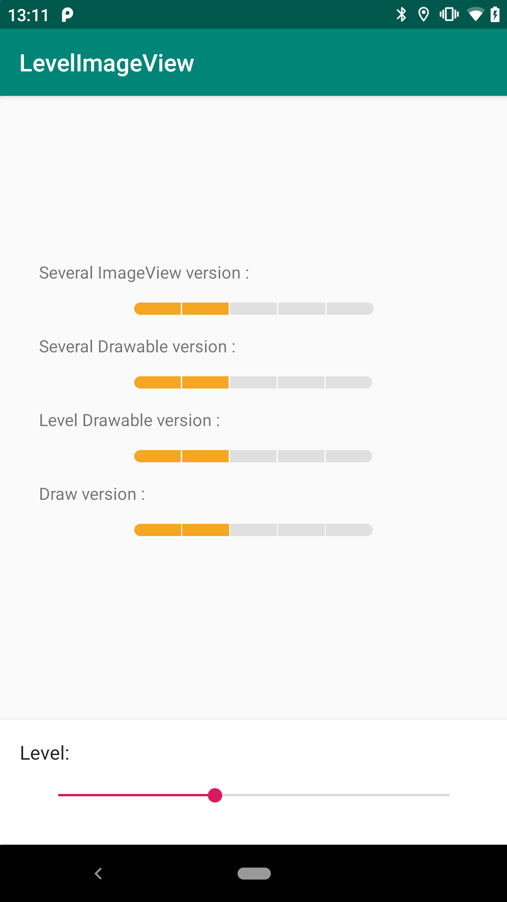

# LevelImageView  

This repository contains several examples of how to build a level image view.
This specific view can display a level (between 0 to 5) as a bar.
The bar is divided in 5 sections and has a specific color for each level.

example : 

### Several Image Views (`SeveralViewLevelImageView`):
This version uses several `ImageView` inside a `LinearLayout`.
Each `ImageView` display a part of the level view.
When the level is set: a specific color filter is set to each `ImageView`.

### Several Drawables (`SeveralDrawableLevelImageView`):
This version uses only one `ImageView`.
6 Drawable were created, each one contains all parts of the level view and represents an unique level.
When the level is set: a specific drawable is set to the view.

### Level Drawable (`LevelDrawableLevelImageView`):
This version uses only one `ImageView`.
It uses the same drawables as the previous version. But this time a Level-Drawable which hold the 6 drawables has been created.
When the level is set: `ImageView.setImageLevel()` is called which will automatically select the right drawable.

### Draw (`DrawLevelImageView`):
This version uses only one `View`.
When the level is set: the view is invalidated. Then the `draw()` method is called and the 5 rectangles are drawn programmatically. 
